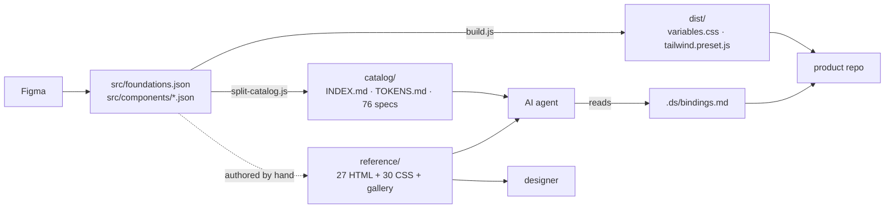
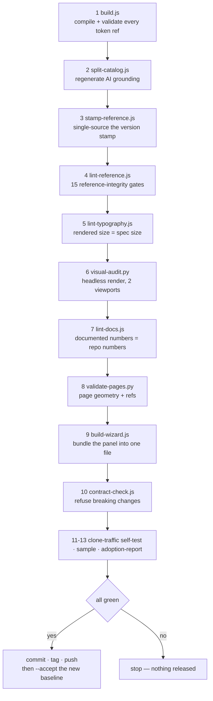
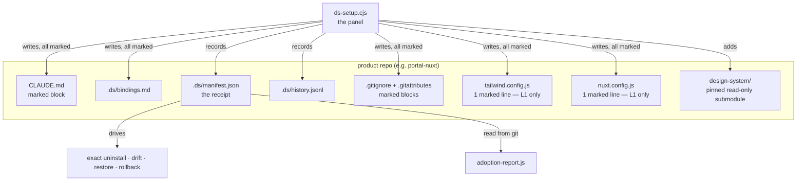
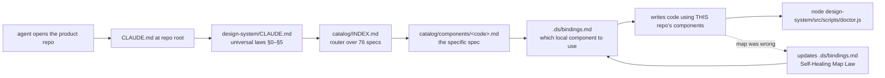

# ARCHITECTURE — how the whole thing fits together

> Regenerated for **v3.5.2** from the repository as it actually is, not from an
> earlier draft. **This file states no counts of its own** — every number lives once, in
> START-HERE §7, where `lint-docs.js` recomputes it on every release. A second copy of a
> fact is a second thing to keep true, and this file spent four releases proving it.
> The master diagram also lives standalone in [`system-map.mermaid`](./system-map.mermaid).

---

## 1. The one idea

Most design systems ship components. This one ships **truth** and refuses to ship code.

The moment a design system injects components into a product repo, that repo has two
sources of truth for the same button — and v2 of this project proved that painfully.
So v3 inverted it: the design system holds tokens, specs and a visual reference;
each product repo keeps its **own** components and a thin map between the two.

An AI coding agent then does the work that used to require a human translator.

---

## 2. Three layers

| Layer | Lives in | Contains | Who reads it |
|---|---|---|---|
| **Truth** | this repo — `src/` compiled to `dist/` + `catalog/` | CSS variables, dark overrides, text styles, component specs, Tailwind colour keys | build scripts, AI agents |
| **Reference** | this repo — `reference/` | plain HTML+CSS component files, per-component stylesheets, a browsable three-tier `gallery.html` | designers (visually), AI agents (structurally) |
| **Binding** | **consumer repo** — `.ds/bindings.md` | maps each spec code to that repo's own component and utility classes | AI agents, and the developers who correct it |

The Binding layer is the hinge. It is the only file that knows both worlds, it lives
in the consumer repo (never here), and it is **expected to drift** — see §6.



---

## 3. What is generated and what is authored

Getting this wrong is the fastest way to lose work.

| Path | Status | Rule |
|---|---|---|
| `src/foundations.json` | **authored** | the only place tokens are defined |
| `src/components/*.json` | **authored** | 76 specs, 64 components + 12 pages |
| `version.json` | **authored** | the single source of the version number |
| `ds-meta.json` | **authored** | maintainer contact, read live by the panel |
| `reference/**` | **authored** (HTML/CSS) | hand-built visual truth; `_fonts.css` and the sprites are generated |
| `tools/dashboard/**` | **authored** | the panel's real sources |
| `dist/**` | generated | `build.js` — never hand-edit |
| `catalog/**` | generated | `split-catalog.js` — never hand-edit |
| `tools/ds-setup.cjs` | generated | `build-wizard.js` — never hand-edit |
| `.release/contract.json` | generated | `contract-check.js --accept` at release time |
| `ADOPTION.md` | generated | `adoption-report.js` |

---

## 4. The release chain

One command, and the order is not negotiable.

```bash
node tools/ship.js
```



Each gate exists because something once slipped past:

| Gate | The failure it prevents |
|---|---|
| `build.js` | a spec referencing a token that does not exist |
| `split-catalog.js` | the AI catalog silently missing 24 of 76 specs (the v3.1 bug) |
| `stamp-reference.js` | reference files claiming a version they were not built for |
| `lint-reference.js` | hardcoded hex · **a font named but never loaded** · hand-drawn icons pretending to be Tabler · a class that resolves to nothing · **a stylesheet the page never links** · a dead anchor · a duplicate id · an undemonstrated rule · unbalanced markup · **scaffolding spliced inside a specimen** · **a second, unmaintained version claim** |
| `lint-typography.js` | a rendered size that contradicts the spec's own `text-style` token |
| `visual-audit.py` | overflow, ghost controls, broken images, the wrong typeface, a size off the ramp — and it opens every `<details>` first, so a collapsed tier is never silently skipped |
| `lint-docs.js` | prose stating a fact about the repository that nothing recomputes |
| `validate-pages.py` | page specs with no geometry |
| `build-wizard.js` | a shipped panel that no longer matches its sources, or reaches the network |
| `contract-check.js` | a token removed without a MAJOR bump and a deprecation alias |

---

## 5. The consumer side

A product repo adopts through the panel: **one file, zero dependencies, plan-first**.



### Adoption levels

| Level | Footprint | Gets you |
|---|---|---|
| **0** | submodule + `CLAUDE.md` block + `.ds/bindings.md` + git housekeeping | full AI grounding, build untouched |
| **1** | Level 0 **+ 2 marked lines** | live token classes and dark mode |

### What is committed and what is not

`.ds/` is **not** ignored wholesale, on purpose:

| Path | Git | Why |
|---|---|---|
| `.ds/manifest.json` | commit | the receipt; also the basis of the adoption report |
| `.ds/bindings.md` | commit | team knowledge, read by every agent |
| `.ds/history.jsonl` | commit | append-only, `merge=union` so parallel installs never conflict |
| `.ds/requests/` | commit | a record of what the team asked the designer for |
| `.ds/.trash/` | ignore | local recovery copies |
| `.ds/rollback-point.json` | ignore | machine-local state |
| `ds-setup.cjs` | ignore | a build artifact of this repo; fetch it, do not vendor it |

---

## 6. Why bindings drift is a feature

`CLAUDE.md` §4 — the Self-Healing Map Law — instructs every AI agent to correct
`.ds/bindings.md` whenever it finds the map wrong. So a repo whose bindings have
changed is a repo that **learned something the shipped template does not know yet**.

The panel therefore classifies managed regions:

| Class | Files | Response |
|---|---|---|
| **contract** | `CLAUDE.md` block, config lines, git blocks | warn, offer **Restore** |
| **living** | `.ds/bindings.md` | neutral notice, offer **Send to designer** |

Treating a living file as damage would make the panel cry wolf on healthy
repositories, and people would learn to ignore it.

---

## 7. Where an AI agent enters



The chain is deliberately four hops with a router in the middle: an agent reads
`TOKENS.md` once for vocabulary, then pulls only the specs it needs. That is why
`TOKENS.md` being polluted with 24 spec bodies (fixed in v3.2.0) was so damaging —
it silently became the agent's idea of the token vocabulary.

**One hop carries a caveat.** Some `catalog/components/<code>.md` entries read
`Reference (DERIVED — NOT design-reviewed · REFERENCE ONLY)`. Those renderings were generated
from the spec JSON and never checked against Figma; they live in gallery **Part 3**, last and
collapsed. An agent must ground on the spec, use the rendering only where it agrees with the
spec, prefer a reviewed component wherever the spec is silent, and let the spec win on any
disagreement — `CLAUDE.md` §1b, restated identically in four places and checked by
`lint-docs.js` so the copies cannot drift.

---

## 8. Current numbers

**They are not here.** Every count in this repository lives once, in
[START-HERE §7](../../START-HERE.md), and `src/scripts/lint-docs.js` recomputes each one from
the repository on every release and stops the release if one has drifted.

This section used to hold its own table. It said 25 of 52 reference codes, 15 Tabler icons,
99 assertions and a 7-step release chain — all true when written, none of them true four
releases later, and nothing anywhere was measuring the gap. That is the same species of fault
as the visual-audit gate that existed only in a changelog. The fix is not a more careful table;
it is one table, derived.

---

## 9. Known gaps, open on purpose

- **28 of 64 component specs have a rendering no designer has approved.** Every spec is now
  drawn; what is missing is *review*, not coverage. Those 28 sit in gallery **Part 3**, last
  and collapsed, marked `data-derived="true"`, and their catalog entries carry the full
  reference-only rule. Approving one is deleting an attribute. The itemised list is in
  START-HERE §8.
- **Asset coverage:** avatars 1/41, icons-custom 35/94; illustrations and logos not
  exported. `build.js` writes an honest **Files:** coverage line into each catalog
  entry so no agent references a file that does not exist.
- **`contract-check.js` has a baseline from v3.2.0 onward.** It protects releases
  going forward, not retroactively.
- **The gates cover the failures already had.** v3.5.2 found four broken gallery sections
  behind fifteen green gates, all of them by a person scrolling the page. `HISTORY.md` law #1
  is a division of labour, not a warning about tooling: automate the floor, then go and look.

---

## 10. Reading order for a new maintainer

1. `CLAUDE.md` — the universal laws. Everything obeys these.
2. This file.
3. `SAFETY.en.md` — exactly what the panel touches.
4. `reference/gallery.html` — open it in a browser.
5. `catalog/INDEX.md` — how an agent navigates.
6. `TUTORIAL.en.md` — the operational runbook.
7. `HISTORY.md` — the three failures that shaped all of the above.
